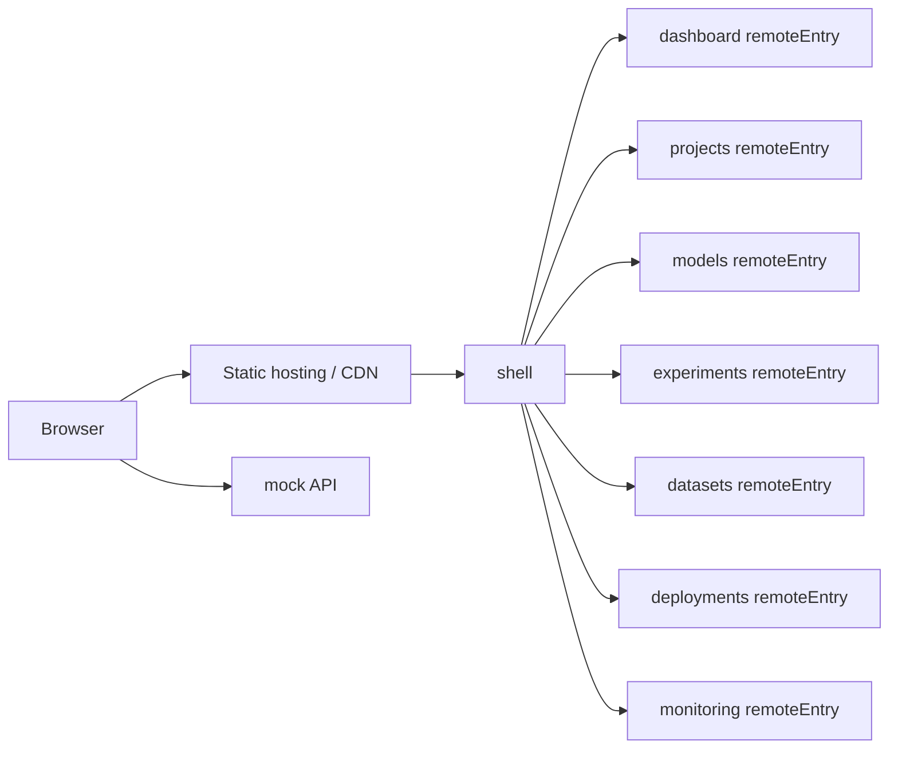
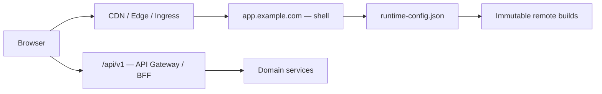

# Архитектура микрофронтендов MLOps Control Hub

Статус: архитектура первого этапа с зафиксированным целевым направлением, версия 1.1  
Стек: React, TypeScript, Vite, pnpm workspaces, Module Federation

## 1. Контекст и цели

Опубликованная версия MLOps Control Hub представляет единый интерфейс с общим боковым меню, профилем пользователя, глобальным поиском и семью предметными разделами. В интерфейсе прослеживаются основные связи:

- dashboard агрегирует проекты, модели, развёртывания и инциденты;
- проект связан с моделями, датасетами, экспериментами и развёртываниями;
- модель принадлежит проекту и содержит историю версий;
- эксперимент использует датасет и может создавать модель-кандидат;
- deployment связывает проект и конкретную версию модели;
- monitoring создаёт события для deployment и проекта.

Цель декомпозиции — дать каждой предметной области независимый цикл запуска, сборки и последующего деплоя, сохранив единый пользовательский интерфейс через shell.

### Обязательный состав приложений

Решение состоит ровно из восьми отдельных Vite-приложений:

1. `shell` — host-приложение;
2. `dashboard` — remote;
3. `projects` — remote;
4. `models` — remote;
5. `experiments` — remote;
6. `datasets` — remote;
7. `deployments` — remote;
8. `monitoring` — remote.

Все семь remote обязательны уже на первом этапе. Их нельзя объединять между собой, реализовывать как страницы одного React-приложения или встраивать исходным кодом в `shell`. Каждый раздел является отдельным Vite-приложением со своими `package.json`, `vite.config.ts`, standalone bootstrap, маршрутами, API-слоем, production build и Module Federation entry. `shell` подключает все семь приложений только как remote через Module Federation.

## 2. Архитектурные принципы

1. `shell` владеет общим layout, меню, верхнеуровневой маршрутизацией и загрузкой remote-модулей.
2. Каждый remote владеет своей предметной областью, маршрутами под выделенным URL-префиксом и собственным API-слоем.
3. Каждый remote запускается standalone и собирается без запущенного `shell` и других remote.
4. Между микрофронтендами нет прямых импортов исходного кода и общего изменяемого store.
5. Связи между областями передаются через стабильные идентификаторы и URL; данные загружаются владельцем области через API-клиент.
6. React и React DOM разделяются через Module Federation как singleton-зависимости. React Router имеет единственный совместимый экземпляр в интегрированном режиме.
7. Отказ одного remote не разрушает shell: каждая граница загрузки имеет `Suspense`, error boundary и возможность повторной загрузки.
8. DTO, маршруты и API-контракты отделены от React-компонентов.
9. Mock-режим и будущий real-режим используют одинаковые интерфейсы API-клиентов.
10. Целевая production-архитектура не расширяет фактический объём первого этапа.

## 3. Границы микрофронтендов

| Приложение | Ответственность | Вне границы |
|---|---|---|
| `shell` | общий layout, меню, демонстрационный профиль, глобальный поиск, верхнеуровневые маршруты, загрузка remote, обработка ошибок | предметные таблицы, формы и бизнес-правила областей |
| `dashboard` | сводные KPI, открытые инциденты, последние deployments, быстрые переходы | изменение проектов, deployments или инцидентов |
| `projects` | список и карточка проекта, создание/редактирование, команда и статус, ссылки на связанные сущности | управление версиями моделей, прогонами и runtime |
| `models` | реестр моделей, карточка модели, версии, стадии и регистрация артефактов | запуск обучения и управление endpoint |
| `experiments` | список прогонов, запуск прогона, статус, параметры, метрики, артефакты и lineage | регистрация production-версии и deployment |
| `datasets` | каталог датасетов, версии, источники, схемы, lineage и регистрация датасета | хранение больших данных и обучение моделей |
| `deployments` | список и карточка endpoint, окружение, версия модели, трафик, демонстрационные операции и runtime-метрики | правила детектирования инцидентов и model registry |
| `monitoring` | список и карточка инцидента, фильтры, acknowledge/resolve, алерты и внешние ссылки | эксплуатационная конфигурация deployment и модельный реестр |

`dashboard` остаётся read-only агрегатором. На первом этапе его агрегирующие ответы предоставляет mock API. В целевой архитектуре тот же frontend-контракт может реализовать BFF или backend-агрегатор.

## 4. Маршрутизация

`shell` создаёт browser router верхнего уровня и монтирует remote под закреплёнными URL-префиксами. Каждый remote экспортирует `./routes` или эквивалентный корневой модуль. В standalone-режиме remote создаёт собственный router вокруг того же дерева маршрутов.

| URL | Владелец | Назначение |
|---|---|---|
| `/` | `dashboard` | сводный экран платформы |
| `/projects` | `projects` | список проектов |
| `/projects/new` | `projects` | создание проекта |
| `/projects/:projectId` | `projects` | карточка проекта |
| `/projects/:projectId/edit` | `projects` | редактирование проекта |
| `/models` | `models` | реестр моделей |
| `/models/new` | `models` | регистрация модели |
| `/models/:modelId` | `models` | карточка и история версий |
| `/models/:modelId/versions/:versionId` | `models` | карточка версии |
| `/experiments` | `experiments` | список прогонов |
| `/experiments/new` | `experiments` | запуск прогона |
| `/experiments/:experimentId` | `experiments` | карточка прогона |
| `/datasets` | `datasets` | каталог датасетов |
| `/datasets/new` | `datasets` | регистрация датасета |
| `/datasets/:datasetId` | `datasets` | карточка датасета |
| `/datasets/:datasetId/versions/:versionId` | `datasets` | карточка версии данных |
| `/deployments` | `deployments` | список endpoints |
| `/deployments/new` | `deployments` | создание deployment |
| `/deployments/:deploymentId` | `deployments` | карточка deployment и runtime-метрики |
| `/monitoring` | `monitoring` | список инцидентов |
| `/monitoring/:incidentId` | `monitoring` | карточка инцидента и действия |
| `/403`, `/404`, `/unavailable` | `shell` | системные состояния |

Правила маршрутизации:

- ссылки между областями — абсолютные application URL, например `/models/:id`, а не импорт компонента другого remote;
- параметры фильтрации и выбранная вкладка сохраняются в query string;
- URL являются публичным frontend-контрактом;
- сервер статических файлов shell и каждого standalone remote возвращает соответствующий `index.html` для неизвестных document-запросов;
- deep links должны работать как через shell, так и после обновления standalone-страницы;
- remote использует тот же URL-префикс либо конфигурируемый `basename`.

## 5. Структура монорепозитория

```text
mlops-control-hub/
├─ apps/
│  ├─ shell/
│  ├─ dashboard/
│  ├─ projects/
│  ├─ models/
│  ├─ experiments/
│  ├─ datasets/
│  ├─ deployments/
│  └─ monitoring/
├─ packages/
│  ├─ ui/                    # токены и общие UI-примитивы
│  ├─ platform-sdk/          # минимальные типы интеграции shell/remote
│  ├─ api-client/            # общий HTTP transport без доменной логики
│  ├─ contracts/             # DTO, TypeScript-типы и API-контракты
│  ├─ config-eslint/
│  ├─ config-typescript/
│  └─ test-utils/
├─ mocks/
│  ├─ handlers/              # handlers по предметным областям
│  ├─ fixtures/              # mock-данные, недоступные React-компонентам напрямую
│  └─ server/                # standalone mock API на порту 4010
├─ tooling/
│  ├─ federation/
│  └─ scripts/
├─ hosting/                  # конфигурация статического хостинга и SPA fallback
├─ pnpm-workspace.yaml
├─ package.json
├─ pnpm-lock.yaml
├─ tsconfig.base.json
└─ ARCHITECTURE.md
```

На первом этапе каталоги Kubernetes и Helm не создаются.

Внутренний шаблон каждого remote:

```text
apps/<remote>/
├─ src/
│  ├─ app/                   # standalone bootstrap и providers
│  ├─ api/                   # собственный доменный API-клиент
│  ├─ contracts/             # доменные DTO или re-export общих контрактов
│  ├─ federation/            # публичный модуль ./routes
│  ├─ pages/
│  ├─ features/
│  ├─ entities/
│  ├─ shared/
│  ├─ routes.tsx
│  └─ main.tsx
├─ index.html
├─ vite.config.ts
├─ tsconfig.json
└─ package.json
```

Каждый remote публикует минимальную поверхность `./routes`. Доменные hooks, stores, API-клиенты и компоненты не экспортируются другим приложениям.

## 6. Module Federation

Логические имена remote и их публичные модули:

```text
dashboard/Routes
projects/Routes
models/Routes
experiments/Routes
datasets/Routes
deployments/Routes
monitoring/Routes
```

Каждый remote формирует собственные:

- `index.html` для standalone-режима;
- application bundle;
- production build directory;
- `remoteEntry.js`;
- дерево маршрутов;
- API-слой.

Standalone bootstrap и federation entry используют одно дерево маршрутов и одну предметную реализацию. `shell` не содержит fallback-копий страниц remote.

Shared policy:

- `react`, `react-dom` — singleton;
- `react-router`, `react-router-dom` — singleton в интегрированном режиме;
- совместимые версии shared-зависимостей фиксируются в корневом workspace;
- доменные stores и API-клиенты не являются shared-модулями;
- каждый remote оборачивается в независимые `Suspense` и error boundary.

URL всех remote задаются через переменные окружения shell или локальный runtime config, а не жёстко в React-компонентах.

## 7. Этап 1: демонстрационная реализация

### 7.1 Цель этапа

Собрать работающую frontend-демонстрацию архитектуры из восьми независимых Vite-приложений, визуально и функционально покрывающую существующие разделы продукта. Этап подтверждает границы, маршрутизацию, Module Federation, независимые сборки, API-слои, mock-данные и готовность статических артефактов к хостингу.

### 7.2 Входит в объём

- `shell` с общим layout, меню, демонстрационным профилем и маршрутизацией;
- все семь обязательных remote без объединения разделов;
- основные list/detail/create/edit маршруты из раздела 4;
- отдельный standalone-запуск каждого приложения;
- отдельный production build каждого приложения;
- отдельный Module Federation entry каждого remote;
- загрузка всех remote в shell;
- собственный API-слой и DTO для каждого remote;
- mock API с тем же frontend-контрактом, который ожидается от будущего backend;
- loading, empty, error и remote-unavailable состояния;
- SPA fallback для deep links;
- конфигурация сборок для публикации на обычном статическом хостинге/CDN.

### 7.3 Не входит в объём

На первом этапе не реализуются:

- backend и базы данных;
- Kubernetes и Helm;
- OAuth/OIDC, серверная сессия и полноценный RBAC;
- SSE и WebSocket;
- сложный CI/CD pipeline;
- canary deployment;
- production observability;
- полноценный event bus;
- реальное управление ML-инфраструктурой, deployments и алертами.

Действия создания, редактирования, запуска, рестарта, acknowledge и resolve имитируются mock API. Их UI-контракты могут быть показаны, но они не вызывают реальные инфраструктурные операции.

### 7.4 Упрощённое взаимодействие приложений

На первом этапе remote взаимодействуют только через:

1. маршрутизацию по стабильным URL;
2. идентификаторы в URL и DTO;
3. повторное чтение данных через API-клиент владельца области.

Полноценный event bus отсутствует. Если после mock-команды требуется обновить экран текущего remote, он инвалидирует только собственный локальный cache. Междоменные обновления допускается увидеть после нового API-запроса или перехода по маршруту.

## 8. Mock API

### 8.1 Конфигурация

Каждое приложение поддерживает одинаковые переменные окружения:

```dotenv
VITE_API_MODE=mock
VITE_API_BASE_URL=http://localhost:4010/api/v1
```

- `VITE_API_MODE=mock` включает работу с mock API.
- `VITE_API_MODE=real` включает работу с будущим реальным backend.
- `VITE_API_BASE_URL` задаёт базовый URL активного API и не должен быть зашит в компоненты или API-клиенты.
- допустимые значения `VITE_API_MODE` валидируются при старте приложения; неизвестное значение приводит к понятной конфигурационной ошибке.

Пример будущего переключения без изменения React-кода:

```dotenv
VITE_API_MODE=real
VITE_API_BASE_URL=https://api.example.com/api/v1
```

### 8.2 Единый интерфейс режимов

Mock и real режимы реализуют одни и те же TypeScript-интерфейсы:

```ts
interface ProjectsApi {
  list(params?: ProjectsQuery): Promise<ProjectListDto>;
  get(projectId: string): Promise<ProjectDto>;
  create(input: CreateProjectDto): Promise<ProjectDto>;
  update(projectId: string, input: UpdateProjectDto): Promise<ProjectDto>;
}
```

Аналогичный собственный интерфейс создаётся внутри каждого remote. Фабрика API-слоя выбирает transport по `VITE_API_MODE`; страницы и features не знают, какой режим активен.

### 8.3 Обязательные ограничения

- Прямой импорт mock-массивов, fixtures или handlers в React-компоненты, hooks, pages и features запрещён.
- Все данные, включая dashboard и shell search, проходят через API-клиенты.
- Mock fixtures доступны только mock server/handlers.
- API-клиенты возвращают типизированные DTO и нормализованные ошибки.
- Mock API воспроизводит URL, HTTP methods, status codes и основные формы ответов предварительного frontend-контракта.
- Искусственная задержка и сценарии ошибок настраиваются в mock-слое, а не в компонентах.
- API-клиент каждого remote принадлежит этому remote; общий пакет предоставляет только transport, обработку базового URL и общие типы ошибок.

Предпочтительный режим первого этапа — отдельный mock HTTP server на порту `4010`. Это подтверждает реальное прохождение данных через сетевой API-слой и одинаково работает для standalone remote и shell.

## 9. Обмен данными

### 9.1 Shell → remote на первом этапе

Shell предоставляет минимальный, не связанный с OAuth или event bus контекст:

```ts
interface PlatformContext {
  user: DemoUser;
  locale: string;
  navigate(to: string): void;
}
```

Remote не читает storage shell напрямую. Расширение контекста авторизацией, permissions, feature flags или событиями является отдельным будущим решением.

### 9.2 Remote → API

- Все данные проходят через доменный API-клиент remote.
- Общий HTTP transport получает base URL из `VITE_API_BASE_URL`.
- REST/JSON — единственный транспорт первого этапа.
- DTO и TypeScript-типы отделены от view models React-компонентов.
- Polling, SSE и WebSocket на первом этапе не используются.

### 9.3 Remote ↔ remote

Микрофронтенды не вызывают код друг друга. Переход выполняется по URL, после чего целевой remote запрашивает необходимые данные через свой API-клиент. Прямой импорт store, запись в cache другого remote и передача бизнес-объектов через глобальный `window` запрещены.

## 10. Предварительный frontend-контракт API

Список ниже — предварительный frontend-контракт, необходимый для mock API и разработки UI. Он не является утверждённым backend-контрактом и должен быть согласован с backend-командой до реализации реального API. Названия ресурсов, DTO, пагинация, ошибки, права доступа и семантика команд могут быть уточнены по итогам согласования.

Все endpoints имеют предполагаемый префикс `/api/v1`.

### Platform и dashboard

- `GET /session` — будущий пользователь, роли и permissions; на этапе 1 возвращает demo session;
- `POST /session/logout` — будущая команда завершения сессии; на этапе 1 может быть заглушкой;
- `GET /feature-flags` — будущие feature flags; не обязателен для UI этапа 1;
- `GET /search?q=&types=&limit=` — глобальный поиск;
- `GET /dashboard/summary` — KPI платформы;
- `GET /dashboard/activity` — последние deployments и события;
- `GET /dashboard/incidents?status=open&limit=` — критичные открытые инциденты.

### Projects

- `GET /projects`;
- `POST /projects`;
- `GET /projects/{projectId}`;
- `PATCH /projects/{projectId}`;
- `GET /projects/{projectId}/summary`;
- `GET /projects/{projectId}/members`;
- `PUT /projects/{projectId}/members`;
- `GET /projects/{projectId}/models`;
- `GET /projects/{projectId}/datasets`;
- `GET /projects/{projectId}/experiments`;
- `GET /projects/{projectId}/deployments`.

### Models

- `GET /models`;
- `POST /models`;
- `GET /models/{modelId}`;
- `PATCH /models/{modelId}`;
- `GET /models/{modelId}/versions`;
- `POST /models/{modelId}/versions`;
- `GET /models/{modelId}/versions/{versionId}`;
- `PATCH /models/{modelId}/versions/{versionId}/stage`;
- `GET /models/{modelId}/versions/{versionId}/metrics`;
- `GET /models/{modelId}/versions/{versionId}/artifacts`.

### Experiments

- `GET /experiments`;
- `POST /experiments`;
- `GET /experiments/{experimentId}`;
- `POST /experiments/{experimentId}/cancel`;
- `POST /experiments/{experimentId}/retry`;
- `GET /experiments/{experimentId}/metrics`;
- `GET /experiments/{experimentId}/parameters`;
- `GET /experiments/{experimentId}/artifacts`;
- `GET /experiments/{experimentId}/logs`;
- `GET /experiments/stream` — целевой SSE endpoint, не реализуется на этапе 1.

### Datasets

- `GET /datasets`;
- `POST /datasets`;
- `GET /datasets/{datasetId}`;
- `PATCH /datasets/{datasetId}`;
- `GET /datasets/{datasetId}/versions`;
- `POST /datasets/{datasetId}/versions`;
- `GET /datasets/{datasetId}/versions/{versionId}`;
- `GET /datasets/{datasetId}/versions/{versionId}/schema`;
- `GET /datasets/{datasetId}/versions/{versionId}/profile`;
- `GET /datasets/{datasetId}/lineage`.

### Deployments

- `GET /deployments`;
- `POST /deployments`;
- `GET /deployments/{deploymentId}`;
- `PATCH /deployments/{deploymentId}`;
- `POST /deployments/{deploymentId}/restart`;
- `POST /deployments/{deploymentId}/rollback`;
- `PATCH /deployments/{deploymentId}/traffic`;
- `GET /deployments/{deploymentId}/metrics?from=&to=&resolution=`;
- `GET /deployments/{deploymentId}/events`;
- `GET /deployments/stream` — целевой SSE endpoint, не реализуется на этапе 1.

### Monitoring

- `GET /incidents`;
- `GET /incidents/{incidentId}`;
- `POST /incidents/{incidentId}/acknowledge`;
- `POST /incidents/{incidentId}/resolve`;
- `POST /incidents/{incidentId}/reopen`;
- `GET /incidents/{incidentId}/timeline`;
- `POST /incidents/{incidentId}/comments`;
- `GET /incidents/stream` — целевой SSE endpoint, не реализуется на этапе 1;
- `GET /alert-rules`;
- `POST /alert-rules`;
- `PATCH /alert-rules/{ruleId}`;
- `DELETE /alert-rules/{ruleId}`.

Предполагаемый целевой контракт списков использует `cursor`, `limit`, `sort` и доменные фильтры. `Idempotency-Key`, `ETag` и `If-Match` относятся к целевой backend-архитектуре; mock API первого этапа может не реализовывать их полностью.

## 11. Локальные порты

| Приложение/сервис | Порт | Standalone URL | Federation entry |
|---|---:|---|---|
| `shell` | 5173 | `http://localhost:5173` | — |
| `dashboard` | 5174 | `http://localhost:5174` | `http://localhost:5174/assets/remoteEntry.js` |
| `projects` | 5175 | `http://localhost:5175/projects` | `http://localhost:5175/assets/remoteEntry.js` |
| `models` | 5176 | `http://localhost:5176/models` | `http://localhost:5176/assets/remoteEntry.js` |
| `experiments` | 5177 | `http://localhost:5177/experiments` | `http://localhost:5177/assets/remoteEntry.js` |
| `datasets` | 5178 | `http://localhost:5178/datasets` | `http://localhost:5178/assets/remoteEntry.js` |
| `deployments` | 5179 | `http://localhost:5179/deployments` | `http://localhost:5179/assets/remoteEntry.js` |
| `monitoring` | 5180 | `http://localhost:5180/monitoring` | `http://localhost:5180/assets/remoteEntry.js` |
| mock API | 4010 | `http://localhost:4010/api/v1` | — |
| будущий API gateway | 8080 | `http://localhost:8080/api/v1` | — |

Корневые команды workspace:

- `pnpm dev` — shell, все семь remote и mock API;
- `pnpm --filter @mlops/dashboard dev` — standalone-запуск одного remote;
- `pnpm --filter @mlops/projects dev` — standalone-запуск одного remote;
- `pnpm --filter @mlops/projects build` — независимая production-сборка одного remote;
- `pnpm --filter @mlops/shell dev` — shell с URL всех семи remote из окружения;
- `pnpm build` — отдельная сборка каждого из восьми приложений средствами workspace orchestration.

Наличие корневой команды не отменяет самостоятельность package scripts каждого приложения.

## 12. Хостинг первого этапа

Первый этап требует готовых к хостингу статических артефактов, но не требует Kubernetes, Helm, canary или сложного deployment pipeline.



Для этапа 1 достаточно:

- восьми независимо собранных каталогов `dist`;
- доступных по HTTP(S) `remoteEntry.js` всех семи remote;
- CORS и корректного JavaScript MIME type для federation assets;
- SPA fallback на `index.html` для shell и standalone remote;
- environment-specific URL remote и API;
- простого smoke test после публикации.

`shell` и все remote не должны предполагать, что они размещены одним процессом или собираются одновременно.

## 13. Целевая production-архитектура

Этот раздел описывает направление после этапа 1 и не входит в объём демонстрационной реализации.



Целевое состояние может включать:

- реальный backend, API gateway/BFF и доменные сервисы;
- OAuth/OIDC или защищённую серверную сессию;
- RBAC и feature flags;
- SSE/WebSocket только для подтверждённых real-time сценариев;
- версионируемый минимальный event bus;
- Kubernetes и Helm, если они будут выбраны платформенной командой;
- immutable remote builds и runtime manifest;
- сложный CI/CD, canary rollout и независимый rollback;
- production observability, correlation ID, error reporting и web vitals.

Возможная адресация целевых артефактов:

```text
https://app.example.com/                         shell
https://mf.example.com/dashboard/<build-id>/     dashboard assets
https://mf.example.com/projects/<build-id>/      projects assets
https://mf.example.com/models/<build-id>/        models assets
...
https://app.example.com/runtime-config.json      карта remote URL
https://app.example.com/api/v1/*                 API gateway
```

Целевой runtime config позволяет менять версию remote без пересборки shell. Политики immutable caching, совместимости N/N-1, canary и rollback должны проектироваться отдельно и не являются требованиями этапа 1.

## 14. Definition of Done первого этапа

Этап 1 завершён, когда одновременно выполнены все условия:

- [ ] Созданы `shell` и все семь обязательных remote: `dashboard`, `projects`, `models`, `experiments`, `datasets`, `deployments`, `monitoring`.
- [ ] Ни один remote не объединён с другим и не реализован как локальная страница shell.
- [ ] Shell загружает все семь remote через их Module Federation entries.
- [ ] Каждый remote имеет собственный standalone bootstrap и запускается отдельно своей package-командой.
- [ ] Каждый remote имеет собственный production build и собирается отдельно своей package-командой.
- [ ] Каждый remote публикует отдельный `remoteEntry.js`.
- [ ] Все маршруты из согласованного объёма работают в shell и в соответствующем standalone remote.
- [ ] Deep links работают после прямого открытия и обновления страницы.
- [ ] При ошибке загрузки одного remote shell и остальные доступные remote продолжают работать.
- [ ] Для недоступного remote отображается локализованное fallback-состояние с возможностью повторной загрузки.
- [ ] Все экранные данные загружаются через API-слой; React-компоненты не импортируют mock fixtures.
- [ ] У каждого remote есть собственный типизированный API-клиент и DTO/TypeScript-типы.
- [ ] Mock API работает и покрывает необходимые экранные сценарии всех семи remote и shell.
- [ ] `VITE_API_MODE=mock` и `VITE_API_BASE_URL` применяются всеми восемью приложениями согласованно.
- [ ] Переход на реальный API выполняется через environment variables без изменения React-компонентов.
- [ ] Loading, empty и API error состояния предусмотрены в каждом remote.
- [ ] Shell и все семь remote создают статические production-артефакты, готовые к хостингу.
- [ ] Конфигурация хостинга поддерживает federation assets, CORS и SPA fallback.

## 15. Решения перед началом реализации

До создания приложений нужно зафиксировать только решения, необходимые этапу 1:

- конкретный Vite-адаптер Module Federation и его версия;
- формат environment variables для URL всех семи remote;
- библиотека или реализация standalone mock HTTP server;
- общий формат `ApiError`, list responses и DTO naming;
- минимальный состав дизайн-токенов и UI-примитивов;
- стратегия маршрутов remote: экспорт `RouteObject[]` либо корневого route-компонента;
- правила статического хостинга и SPA fallback;
- минимальные smoke tests standalone и shell integration.

OAuth/OIDC, backend ownership, OpenAPI-генерация, SSE/WebSocket, event bus, Kubernetes/Helm, сложный CI/CD, canary и production observability принимаются отдельными архитектурными решениями после завершения демонстрационного этапа.
